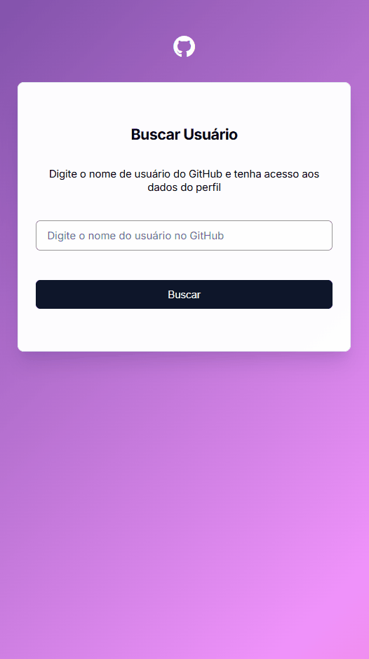

# Visualizador de Perfil do GitHub

Um projeto de visualização de perfis do GitHub simples e responsivo que permite buscar usuários e exibir suas informações e repositórios.

## Visão Geral

Este projeto é uma implementação de front-end para buscar e exibir perfis de usuários do GitHub. Ele apresenta um design moderno e limpo, com seções para informações do perfil, contadores de seguidores/seguindo e repositórios recentes. A página é totalmente responsiva e se adapta a diferentes tamanhos de tela.

## Preview 📷

### Mobile


## Funcionalidades ⚙️

- **Design Responsivo:** Layout que se adapta a dispositivos móveis, tablets e desktops.
- **Busca de Usuário:** Campo de busca para encontrar usuários do GitHub pelo nome de usuário.
- **Exibição de Perfil:** Mostra avatar, nome e bio do usuário.
- **Contadores:** Exibe número de seguidores e seguindo.
- **Repositórios Recentes:** Lista os 10 repositórios mais recentes com nome, descrição, stars e forks.
- **Links para Repositórios:** Cada repositório possui link direto para o GitHub.

## Tecnologias Utilizadas 👨‍💻

- **HTML:** Para a estrutura da página.
- **CSS:** Para estilização e layout responsivo.
- **JavaScript:** Para lógica de busca e manipulação do DOM, utilizando módulos para separação de responsabilidades.

## Estrutura do Projeto 📂

O projeto está organizado da seguinte forma:

```
visualizador-perfil-GitHub/
├── Js/
│   ├── api.js
│   ├── main.js
│   └── ui.js
├── src/
│   ├── assets/
│   │   ├── Animação-desktop.gif
│   │   └── Animação-mobile.gif
│   └── css/
│       ├── animations.css
│       ├── reset.css
│       ├── responsive.css
│       └── styles.css
├── index.html
└── README.md
```

- **`index.html`**: O arquivo principal da página.
- **`Js/`**: Contém os módulos JavaScript.
  - **`api.js`**: Funções de chamada à API do GitHub.
  - **`ui.js`**: Funções de renderização do DOM.
  - **`main.js`**: Ponto de entrada e event listeners.
- **`src/css/`**: Contém todos os arquivos de estilo.
  - **`reset.css`**: Reset de estilos padrão do navegador.
  - **`styles.css`**: Estilos principais da aplicação.
  - **`responsive.css`**: Media queries para responsividade.
  - **`animations.css`**: Animações CSS.
- **`src/assets/`**: Contém as animações de preview.

## Como executar 💪

1 - Clone o repositório:

```
git clone https://github.com/DuLean9/visualizador-perfil-GitHub.git
```
2 - Entre na pasta:

```
cd visualizador-perfil-GitHub
```

3 - Abra o VS Code:

```
code . 
```

## Demonstração 👁️
🔗 Acesse o projeto aqui: ()
